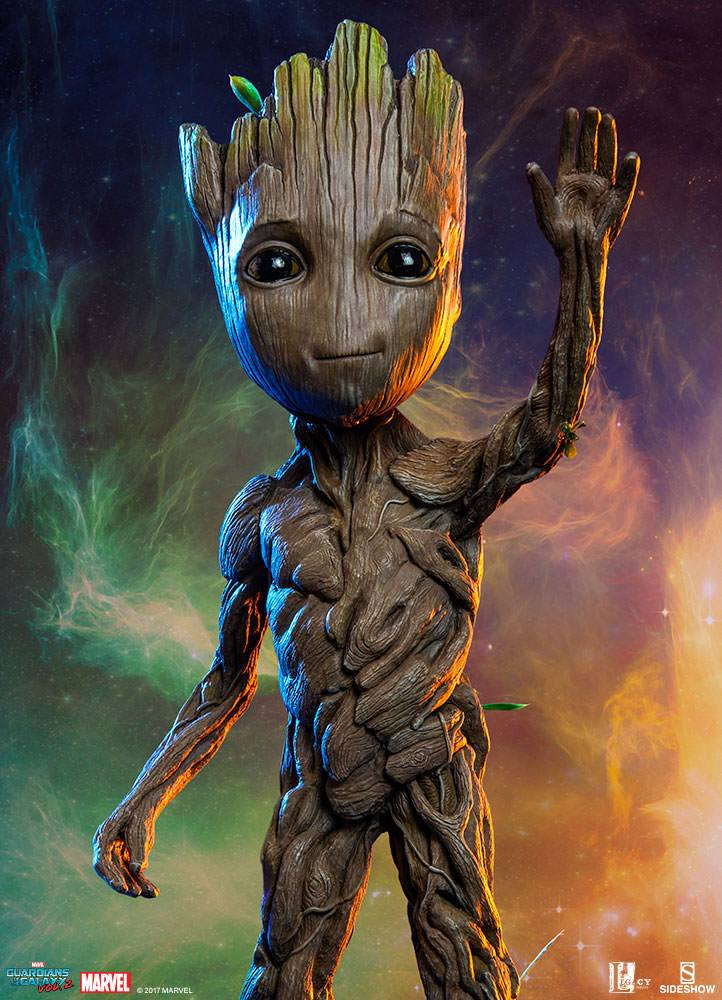
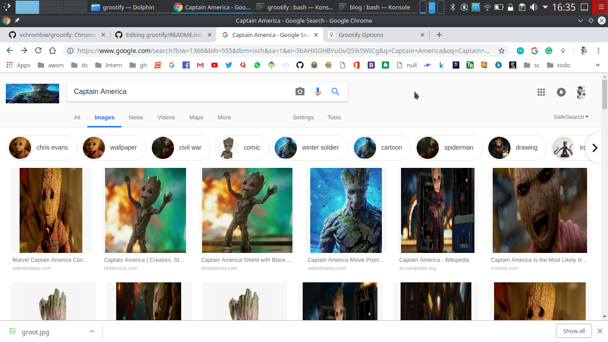

# grootify

Chrome Extension that replaces every image of your web page with Groot.

## Getting Started
These instructions will get you a copy of the project up and running on your local machine for development and testing purposes. See deployment for notes on how to deploy the project on a live system.

## Installing the Chrome Extension
1. Get the source code.
```
git clone https://github.com/vchrombie/grootify/
```
2. Open the chrome browser. Click on Options (top right) >> More tools >> Extensions.
3. Click on **Load unpacked** button. You can go through the browse the folder to the place where to clone your repo.
4. Select the `grootify/` folder and click on *Ok*.
5. You can enable or disable the extension. Please check the *Running the tests* for how to test it.

## Running the tests
1. Click on this link. [Captain America - Google Search Images](https://www.google.com/search?q=Captain+America&biw=1366&bih=604&source=lnms&tbm=isch&sa=X&ved=0ahUKEwicptOBv4jfAhWMsI8KHVJUC-4Q_AUIDigB). This searches for the images of Captain America in Google.
2. Initially, you can see the images of the required search.
3. Click on the grootify extension app, which you can see on the top right corner of the chrome browser. Click on Options.
4. Enable (ON) the grootify switch.
5. No reload the Captain America search again.
6. Wait for a sec and boom. :P

## Screenshots


## Built With
* JavaScript

## Authors
* **Venu Vardhan** - *Initial work* - [vchrombie](https://github.com/vchrombie)

## Contributing
If you are really interested in contributing to the please follow the below steps and rules.
1. Fork the project. *(Give a star ⭐ to the repo before you fork :P)*
2. Clone it.
```git clone https://github.com/<username>/grootify/
```
3. Look for any issues clicking the issues tab. Go through it and assign take one. Make sure you get assigned or atleast say that you are gonna work on it.
4. Always create a new branch and work on the feature or bug. Check this if you are not that familiar with branching, [Git Branching](https://git-scm.com/book/en/v2/Git-Branching-Basic-Branching-and-Merging)
5. Please follow the template created for raising issues or sending pull requests.

## License
This project is licensed under the MIT License - see the [LICENSE.md](LICENSE.md) file for details

## Acknowledgments
* Groot is a property of Marvel Comics.
